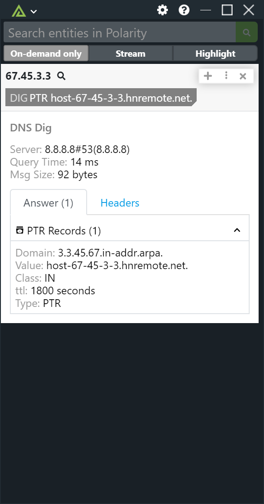

# Polarity Dig Integration


> This integration runs in `On Demand Only` mode

|  ||
|:---:|:---:|:---:|
|*Domain Query with Answers* |*IP Query with PTR Answer*| *IP Query with Authority section*|


The Polarity dig integration leverages the "node-dig-dns" library which provides a simple node wrapper for the unix/linux/macos dig command (domain information grope).  The integration allows you to specify what type of query is run.  By default, the integration runs an A record query for domains and a PTR (reverse DNS) query for IP addresses.  

By default, for domains, this integration runs the dig command:

```
dig A <domain> @dns-server
```

For IP Addresses this integration does a reverse lookup:

```
dig -x <ip-address> @dns-server
```

## Installing Dig

For this integration to work you must have the `dig` command line tool installed on your Polarity Server.  To install `dig` you can install the `bind-utils` package via `yum`:

```
sudo yum install bind-utils -y
```

## Dig Integration Options

### DNS Server
The DNS Server (host or IP) to perform lookups against. If left blank, the Polarity Server's default DNS server will be used. If an invalid or unreachable DNS Server is provided your `dig` requests will eventually time out. Defaults to `8.8.8.8`.

### Private IPs Only

If checked, the integration will only look up private (RFC-1918) IP addresses. Domains will still be looked up unless you turn domains off via the "Manage Integration Data" option.

### Results Filter

Choose which results are displayed. Defaults to always showing a result. Can also be set to only show results with an Answer section, or to only show results with an Answer or Authority section.

## About Polarity

Polarity is a memory-augmentation platform that improves and accelerates analyst decision making.  For more information about the Polarity platform please see:

https://polarity.io/
